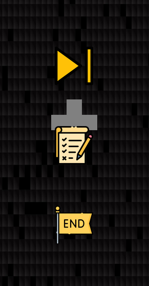
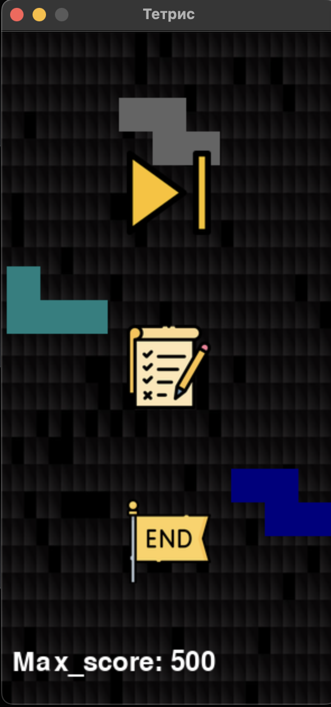

### 1. О проекте
#### a. Название и назначение проекта
- **Название проекта**: Tetris
- **Назначение**: Создание классической игры "Тетрис", где игрок управляет падающими тетромино, пытаясь заполнить горизонтальные линии на игровом поле. Цель игры — набрать как можно больше очков, предотвращая заполнение экрана блоками.

#### b. Количество строк кода проекта
- Примерное количество строк кода: **500–600 строк**.

c. Ссылка на техническое задание
[Техническое задание](materials/technical_specification.md)

### 2. Процесс установки библиотек
-   **В папке есть файл requirements.txt, где подробно описаны 2 варианта скачивания нужных зависимостей**
### 4. Описание работы для обычного пользователя в приложении
-   **Так выглядит меню при открытии программы:**

-   **Так выглядит процесс игры при нажатии на кнопку "старт" (фигуры будут постепенно падать, позже будет добавлен текст):**

-   **Вывод итогов пока что в доработке**
### 5. Скринкаст пока в доработке т.к. программа еще не до конца работает