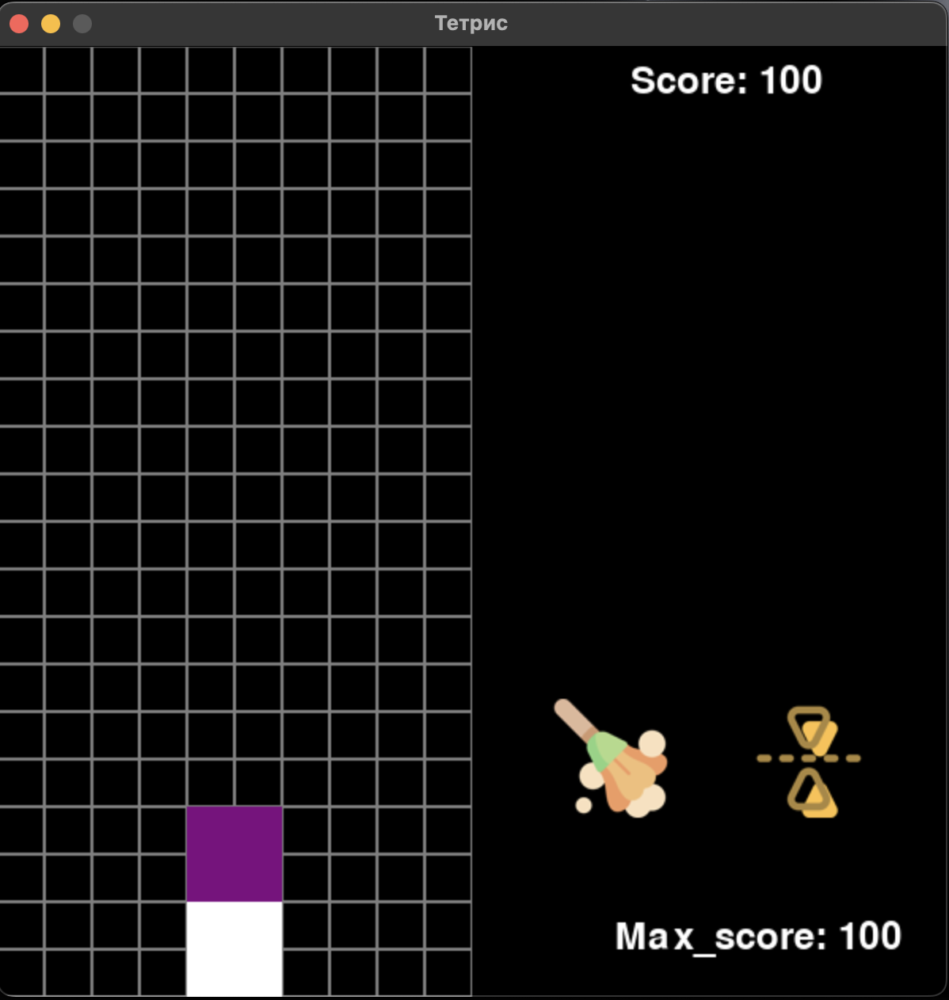

### 1. О проекте
#### a. Название и назначение проекта
- **Название проекта**: Tetris
- **Назначение**: Создание классической игры "Тетрис", где игрок управляет падающими тетромино, пытаясь заполнить горизонтальные линии на игровом поле. Цель игры — набрать как можно больше очков, предотвращая заполнение экрана блоками.

#### b. Количество строк кода проекта
- Примерное количество строк кода: **850 строк**.

c. Ссылка на техническое задание
[Техническое задание](materials/technical_specification.md)

### 2. Процесс установки библиотек
-   **В терминале написать: pyinstaller --onefile --noconsole main.py**

### 3. Добавление новых уровней
-   **В файле Rezvushkin.py можно изминить счет при котором ты побеждаешь, также можно добавить переменную считающую количество очищщенных строк, и игрок выигрывает набрав какое-то количество очищенных линий, также можно добавить фигуры, которые изначально есть на поле, и соответсвено каждый пройденный уровень, усложнять или менять что-то**

### 4. Описание работы для обычного пользователя в приложении
-   **Так выглядит меню при открытии программы:**

-   **Так выглядит процесс игры при нажатии на кнопку "старт" (фигуры будут постепенно падать), их можно переворачивать(стрелка вверх/w), двигать(стерлки вправо/влево/a/d) и моментально убирать вниз(пробел) или по чуть-учть(стрелка вниз/s), есть кнопка очистки (или q), переворота игры (или e), чтобы узнать подробные правила нужно в меню нажать на кнопку rules, когда экран переворачивается все наоборот:**

-   **Вы выигрываете когда набираете 15.000 очков, а проигрываете когда поле заполнено, также есть score - текущий счет, max_score - максмальное количество набранных очков**

### 5. Скринкаст
